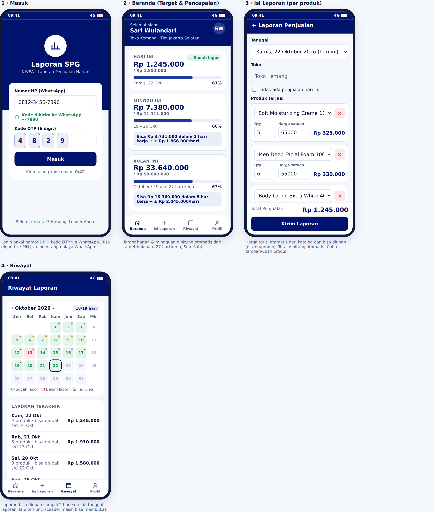
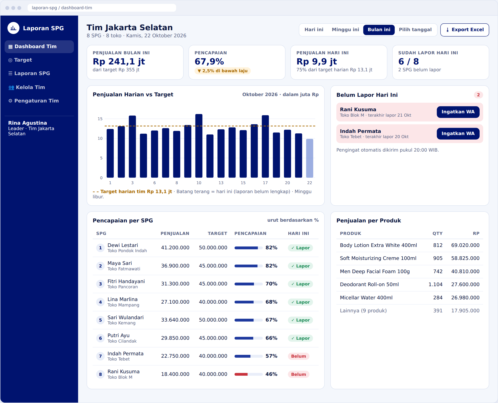
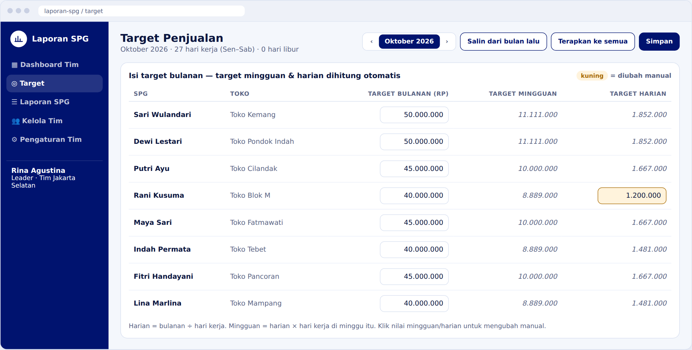
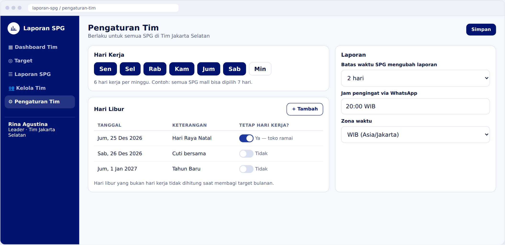
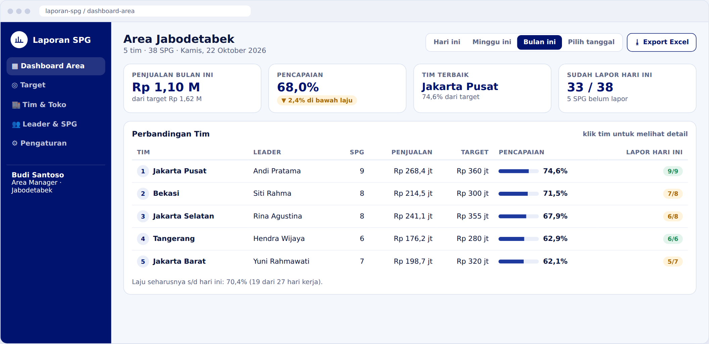

# Mockup — Laporan Harian SPG (NIVEA)

Static HTML mockup of the app with sample data. "Today" in the mockup is **Kamis, 22 Oktober 2026**.
The color palette is based on NIVEA's deep blue (`#00136F`) and white.

**Interactive version:** open [`index.html`](index.html) in a browser. Use the tabs at the top to switch between SPG, Leader and Area Manager.
The report form (add/remove products, totals), the target grid (monthly → weekly/daily) and the working-day toggles all respond to input.

## SPG (mobile)
Login (WhatsApp OTP) · Home (daily/weekly/monthly targets) · Per-product report · History

## Leader — Team dashboard

## Leader — Targets
Monthly target per SPG; weekly and daily targets are calculated automatically, and a manual override shows in yellow.

## Leader — Team settings
Working days, holidays (and whether each holiday is still a working day), 2-day edit window, reminder time.

## Area Manager — Area dashboard

